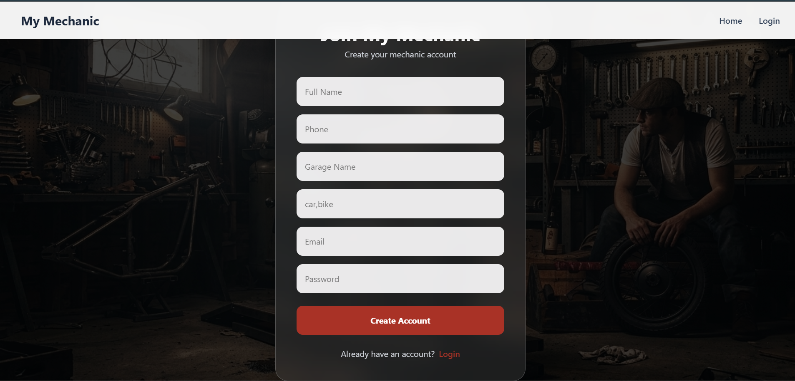
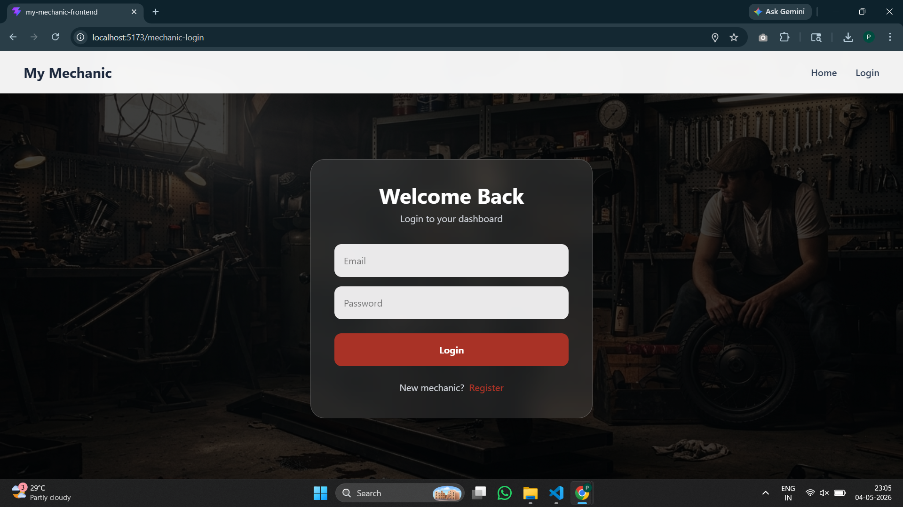
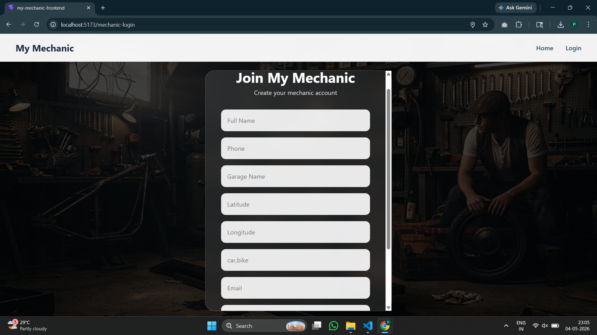
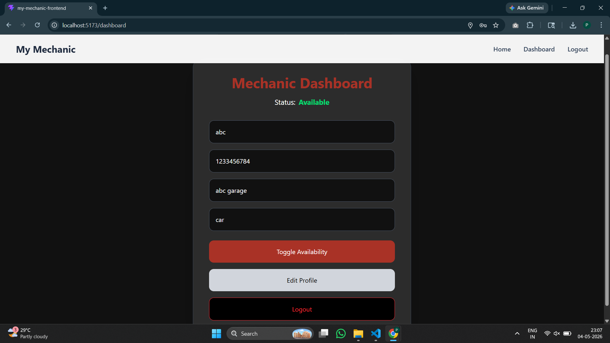
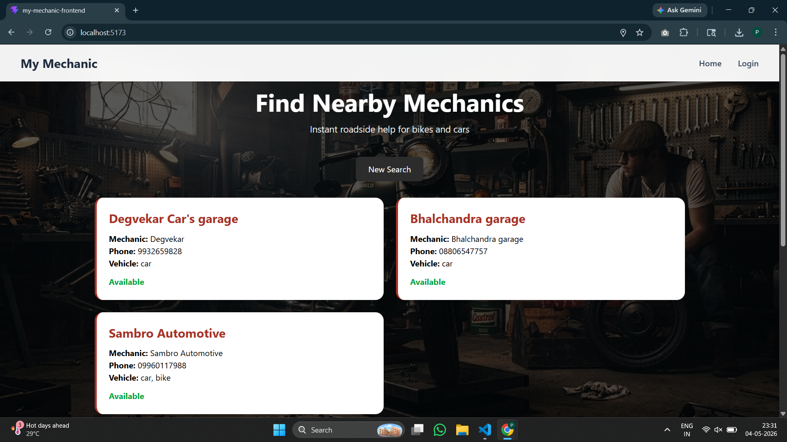

# My Mechanic

A location-based web application that connects stranded users with nearby available mechanics.

## Features
- Real-time nearby mechanic search
- Vehicle-based filtering
- Mechanic login/register
- Availability toggle
- Editable mechanic dashboard
- Location-based matching

## Tech Stack
Frontend:
- React
- Tailwind CSS
- Axios

Backend:
- Node.js
- Express.js

Database:
- MongoDB

Authentication:
- JWT

## Screenshots

### Home Page

### Login

### Register

### Dashboard

### Search Results
